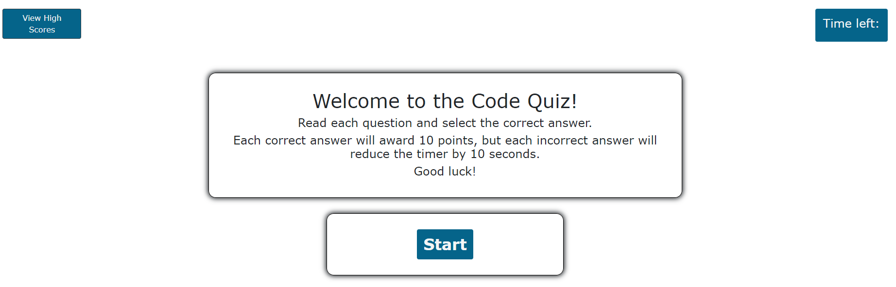
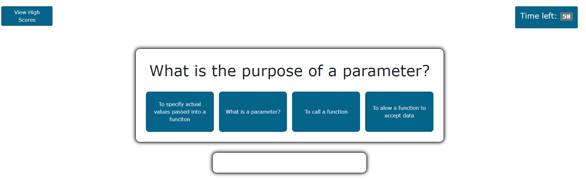
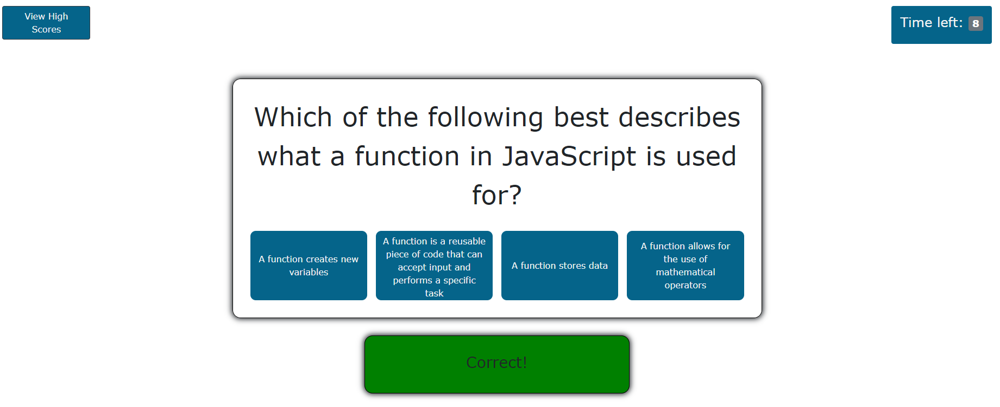
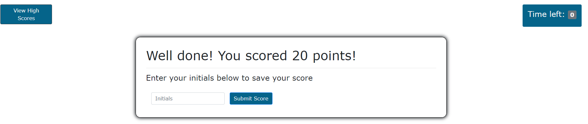
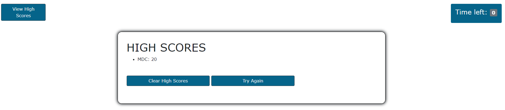

# Welcome to my Code Quiz

This short code quiz was created with HTML, CSS, and vanilla JS. The idea is simple - answer the questions before your time runs out. Every correct answer awards you 10 points, while every incorrect answer reduces your timer by 10 seconds. At the end of the quiz, you have the opportunity to save your score to a high scores list (via local storage). The questions cover JavaScript topics such as variables and arrays. The styling is simple but clean, and I recommend taking the quiz with your sound on.

[Check out the deployed app here!](https://markdcross.github.io/code-quiz/)

# Techniques/skills

This entire quiz lives in one HTML doc. I use DOM manipulation via events and event listeners to create, show, and hide divs and content based on the next step in the quiz logic. The questions and answers live within an array that is randomized each time the quiz is taken. If a question is answered correctly, a "correct" message appears, colors change, and a sound is played. The same occurs for an incorrect answer, though each effect is different.

* HTML
* CSS
* JavaScript
* Intervals

# Usage

Play around with it! I'll add more questions soon, but this showcases the core functionality - questions dynamically populating and answers being selected.

# Screenshots

# License
MIT License

Copyright (c) 2020 Mark Cross

Permission is hereby granted, free of charge, to any person obtaining a copy of this software and associated documentation files (the "Software"), to deal in the Software without restriction, including without limitation the rights to use, copy, modify, merge, publish, distribute, sublicense, and/or sell copies of the Software, and to permit persons to whom the Software is furnished to do so, subject to the following conditions:

The above copyright notice and this permission notice shall be included in all copies or substantial portions of the Software.

THE SOFTWARE IS PROVIDED "AS IS", WITHOUT WARRANTY OF ANY KIND, EXPRESS OR IMPLIED, INCLUDING BUT NOT LIMITED TO THE WARRANTIES OF MERCHANTABILITY, FITNESS FOR A PARTICULAR PURPOSE AND NONINFRINGEMENT. IN NO EVENT SHALL THE AUTHORS OR COPYRIGHT HOLDERS BE LIABLE FOR ANY CLAIM, DAMAGES OR OTHER LIABILITY, WHETHER IN AN ACTION OF CONTRACT, TORT OR OTHERWISE, ARISING FROM, OUT OF OR IN CONNECTION WITH THE SOFTWARE OR THE USE OR OTHER DEALINGS IN THE SOFTWARE.
